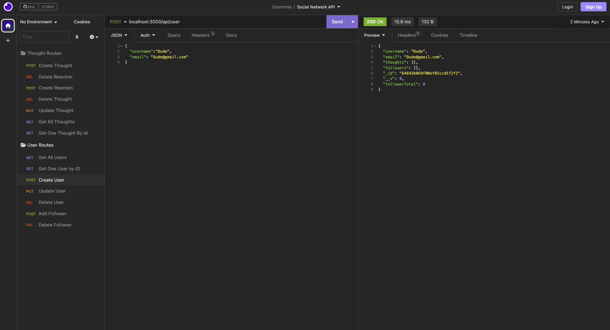
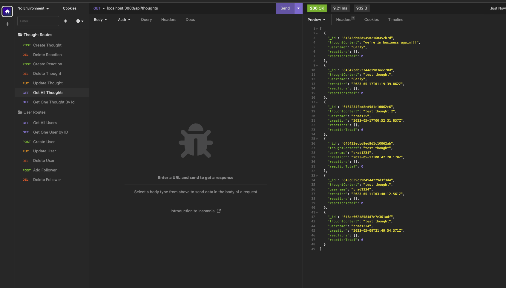

# 18 NoSQL: Social Network API

## Application Functionality

Through use of an API designed specifically for a social network web application, users can share their thoughts, react to friends’ thoughts, and create a friend list.

## Technologies Used

- Express.js for routing
- MongoDB database
- Mongoose ODM
- Native JavaScript `Date` to format timestamps

## User Story

```md
AS A social media startup
I WANT an API for my social network that uses a NoSQL database
SO THAT my website can handle large amounts of unstructured data
```

## Acceptance Criteria

```md
GIVEN a social network API
WHEN I enter the command to invoke the application
THEN my server is started and the Mongoose models are synced to the MongoDB database
WHEN I open API GET routes in Insomnia for users and thoughts
THEN the data for each of these routes is displayed in a formatted JSON
WHEN I test API POST, PUT, and DELETE routes in Insomnia
THEN I am able to successfully create, update, and delete users and thoughts in my database
WHEN I test API POST and DELETE routes in Insomnia
THEN I am able to successfully create and delete reactions to thoughts and add and remove friends to a user’s friend list
```

## Mock Up

The following animations show examples of the application's API routes being tested in Insomnia.

- GET routes to return all users being tested in Insomnia:


- GET routes to return a single user and a single thought being tested in Insomnia:


- POST, PUT, and DELETE routes for users being tested in Insomnia:




The following animation shows the POST and DELETE routes for a user’s followers list being tested in Insomnia:


---

- GET routes to return all thoughts being tested in Insomnia:


- GET routes to return a single thought being tested in Insomnia:


- POST, PUT, and DELETE routes for thoughts being tested in Insomnia:





The following animation shows the POST and DELETE routes for a user’s reactions list being tested in Insomnia:


## Links

Github Repo Link:https://github.com/chelseyvalerio/socialmedia-network-database
Video Demonstration Link:https://drive.google.com/file/d/1Vl_g9Zj3T1efRfGek5LFVugj1ObNY-k_/view

## Contact

Please contact me at cvalerio@csog.net with any questions. Thank you!
